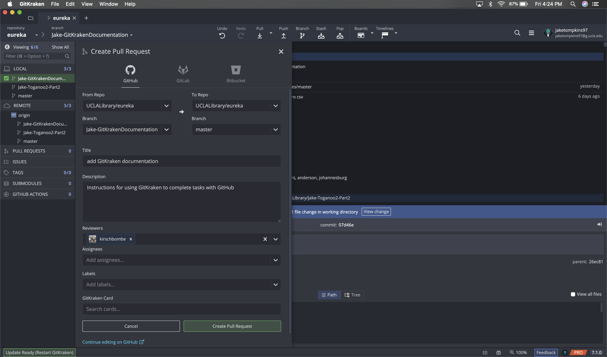

## Working with the Eureka repository (GitKraken)

These instructions are for working with files in the `eureka` repository using GitKraken.

### Setup
* Create a [GitHub](https://docs.github.com/en/github/getting-started-with-github/signing-up-for-a-new-github-account) account (if you do not already have one)
* Install GitKraken
  * [Download](https://gitkraken.com/download) the Git client here (Windows or Mac)

### Workflow

#### Clone the `eureka` repository
  * Clone the repository (repo) to your local machine (**you only have to do this the first time**)
  * On GitHub, copy the URL of the GitHub repo you will be working in
  * On GitKraken, go to File > Open Repo then click "Clone" and paste the URL of the repository and click the green "Clone the repo!" button

  

#### Pull down upstream changes
* At the start of each new task/ticket, make sure you are on the `master` branch and pull down any recent changes

#### Create a new branch for your work
* Using **GitKraken**:
  * Open the Eureka project folder in GitKraken (File > Open Repo > Open a Repository) the Jira ticket number and a very brief description (no spaces or special characters)

  

  * Make sure you are on the master branch. If you are not, click the three dots on the master branch and then click "Checkout master"

  

  * On the master branch, click the three dots again and this time click "Create branch here"

  

  * Name the branch using the Jira ticket number and a very brief description (no spaces or special characters) ex:`Idep-247-arce-batch1` and then hit enter

#### Work on files
* Make any edits to the files and save your work
* Once you are ready to wrap up for the day or session, stage and commit your work:
  * In **GitKraken**:
    * Hit the "Stage all changes"

* Type a commit message into the text box

* Hit the green "Commit changes to # file(s)"

* Click the "Push" button to send your changes to the remote repo

* Confirm you are pushing/pulling from `origin` / `[Your New Branch]` and then click "Submit"

* Repeat these steps until the work is complete

#### Submit your work
* Once you are ready to wrap up your work, you must merge your commits into the master branch
* Click "Pull Requests" on the left-hand side of the screen to begin the request
* In the "From Repo" section be sure to select the repo you are working in and the **branch you created** for your work
* In the "To Repo" section be sure to select the repo you are working in and the **master branch**
* In the "Title" section be sure to include a description of the work you completed
* In the "Description" section it can be helpful to include more details about what changes you made. This helps provide context for whoever approves the request so they can understand what has been updated.
* In the "Reviewers" section you may tag someone to notify them of the pull request you are submitting (may not always be necessary)
* Click the green "Create Pull Request" button
* Now you are finished!

