## Working with the Eureka repository (GitKraken)

These instructions are for working with files in the `eureka` repository using GitKraken.

### Setup
* Create a [GitHub](https://docs.github.com/en/github/getting-started-with-github/signing-up-for-a-new-github-account) account (if you do not already have one)
* Install GitKraken
  * [Download](https://gitkraken.com/download) the Git client here (Windows or Mac)

### Workflow

#### Clone the `eureka` repository
  * Clone the repository (repo) to your local machine (**you only have to do this the first time**)
  * On GitHub, copy the URL of the GitHub repo you will be working in
  * On GitKraken, go to File > Open Repo then click "Clone" and paste the URL of the repository

  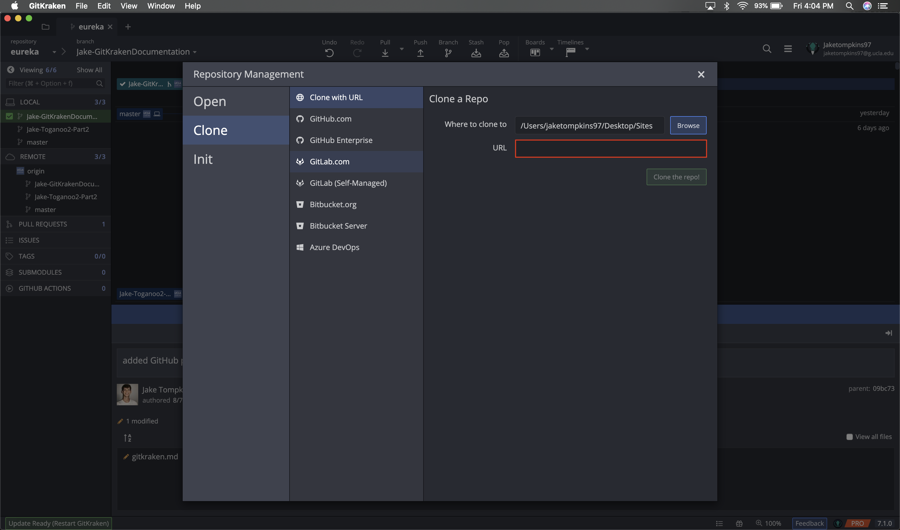

#### Pull down upstream changes
* At the start of each new task/ticket, make sure you are on the `master` branch and pull down any recent changes

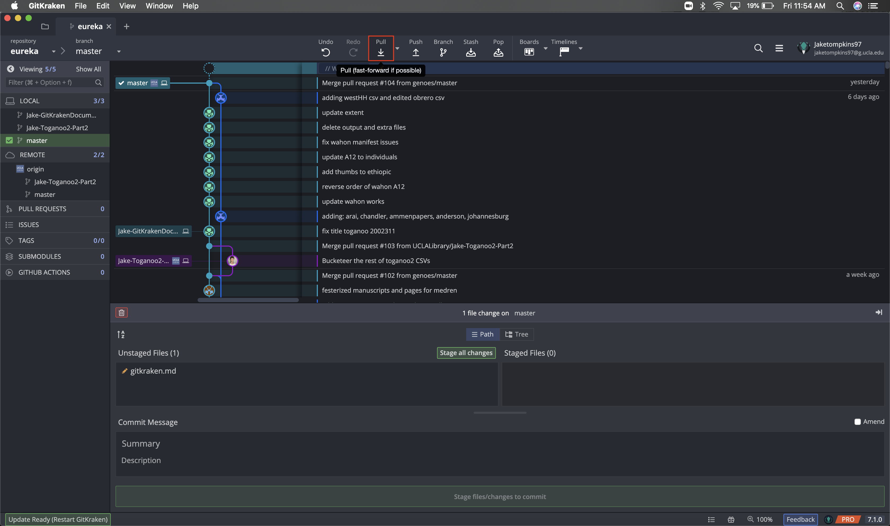

#### Create a new branch for your work
* Using **GitKraken**:
  * Open the Eureka project folder in GitKraken (File > Open Repo > Open a Repository) the Jira ticket number and a very brief description (no spaces or special characters)

  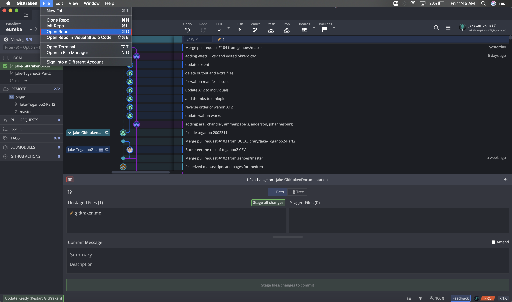

  * Make sure you are on the master branch. If you are not, click the three dots on the master branch and then click "Checkout master"

  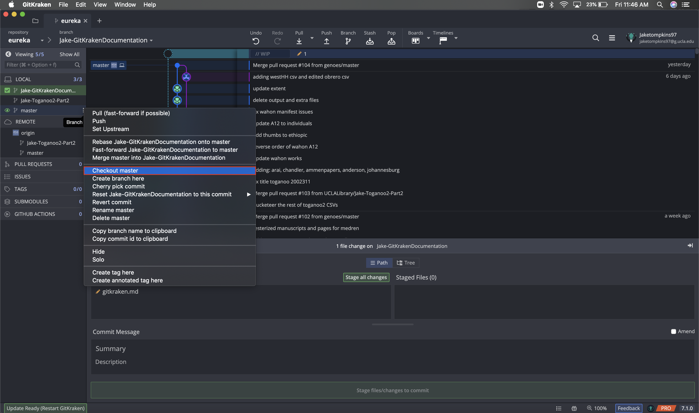

  * On the master branch, click the three dots again and this time click "Create branch here"

  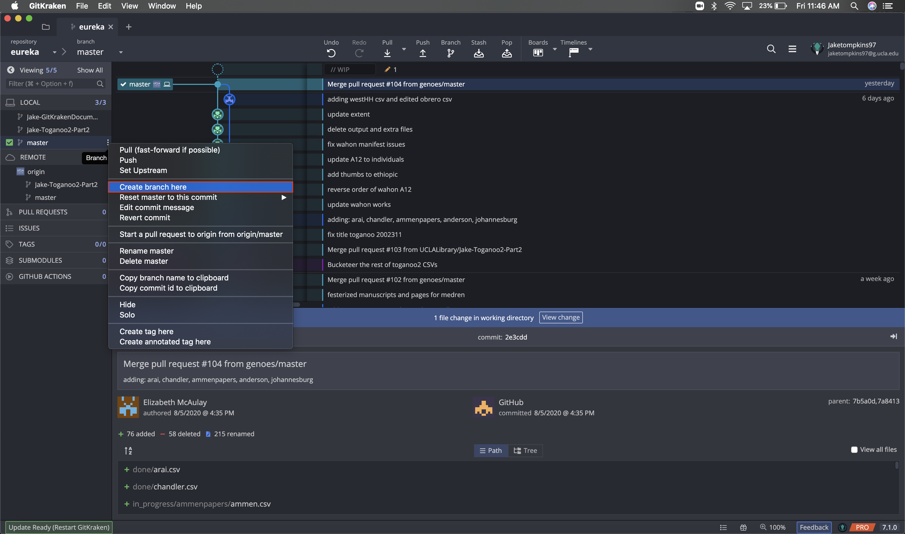

  * Name the branch using the Jira ticket number and a very brief description (no spaces or special characters) ex:`Idep-247-arce-batch1` and then hit enter

#### Work on files
* Make any edits to the files and save your work
* Once you are ready to wrap up for the day or session, stage and commit your work:
  * In **GitKraken**:
    * Hit the "Stage all changes"

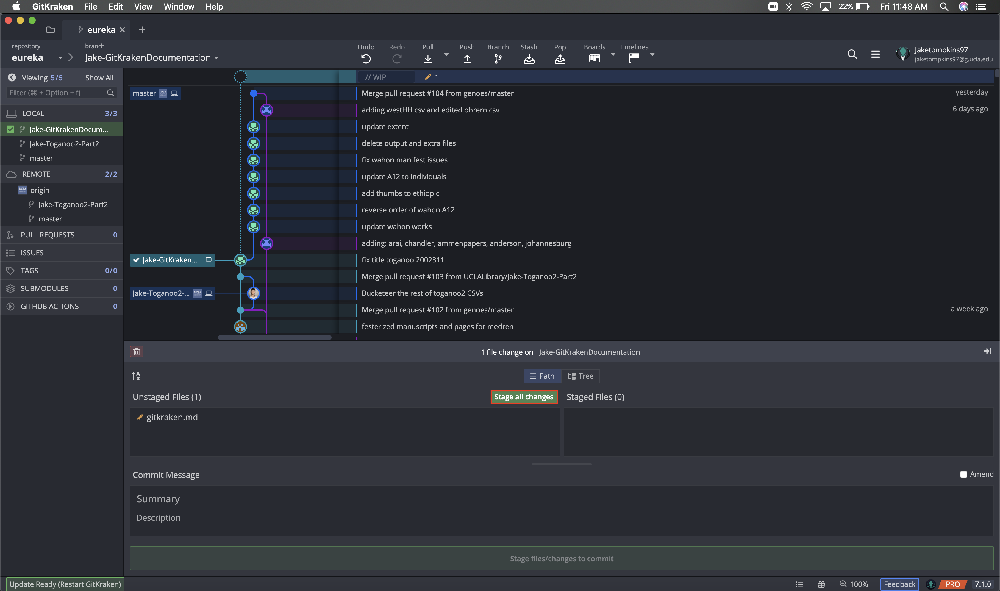

* Type a commit message into the text box

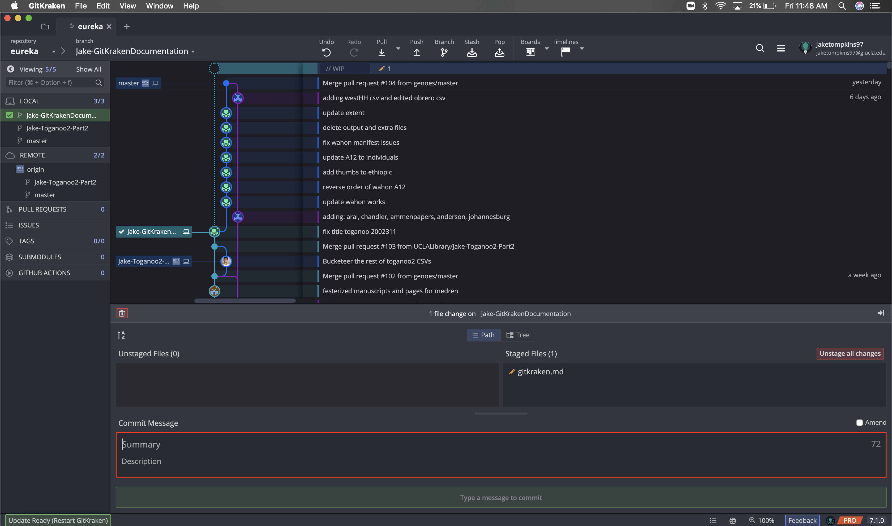

* Hit the green "Commit changes to # file(s)"

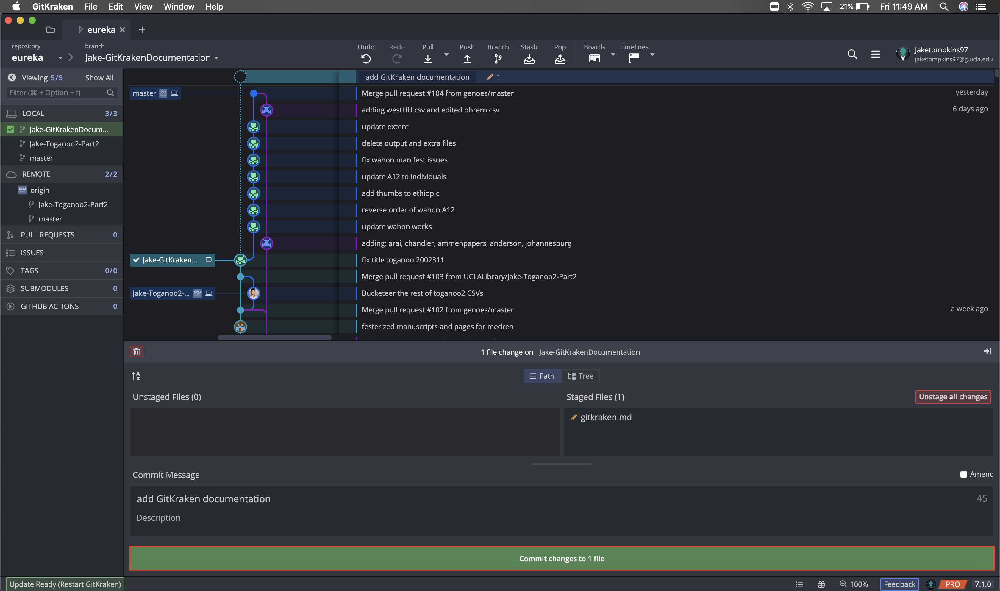

* Click the "Push" button to send your changes to the remote repo

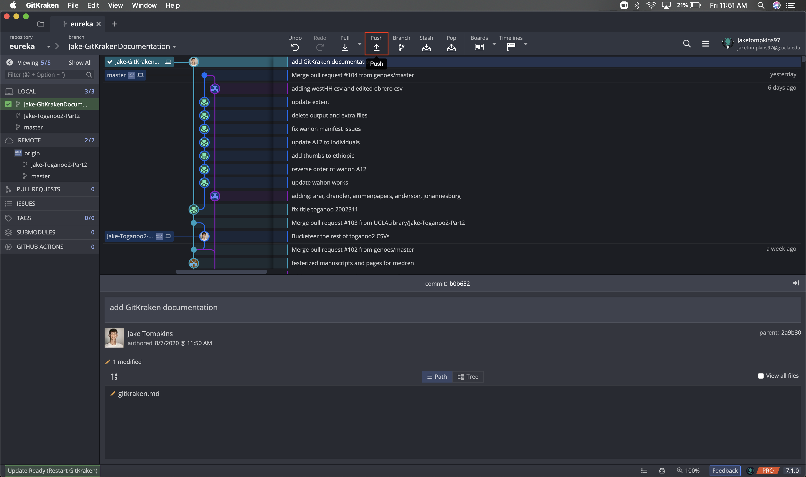

* Confirm you are pushing/pulling from `origin` / `[Your New Branch]` and then click "Submit"

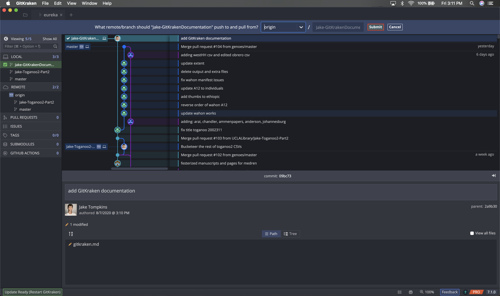

* Repeat these steps until the work is complete

#### Submit your work
* Once you are ready to wrap up your work, you must merge your commits into the master branch
* Go to [GitHub](https://github.com) and on the left-hand side click on the repo you are working in
* Click the green "Compare & pull request" button at the top

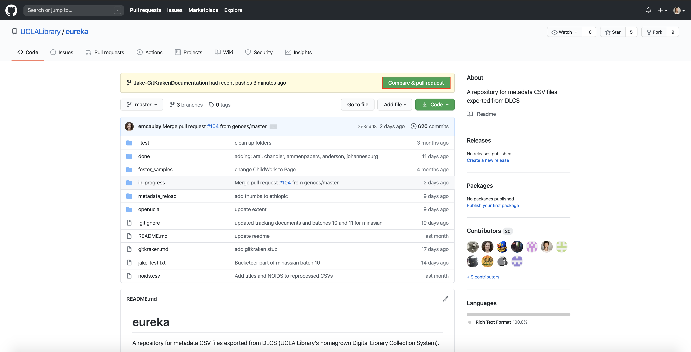

* Create a new pull request on GitHub with your repository with the changes as the head and the repository you forked as the base then hit the green "Create pull request" button

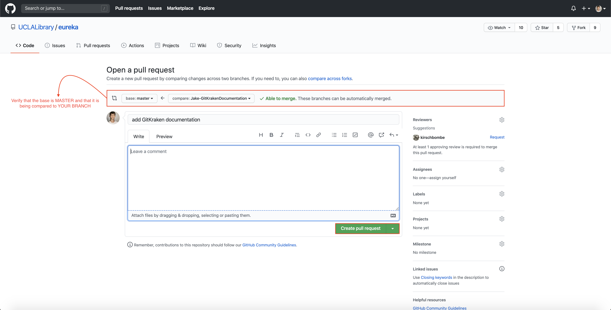

* You will likely be brought to a page with information about your commit and a message indicating your pull request requires review. This means you are all done!

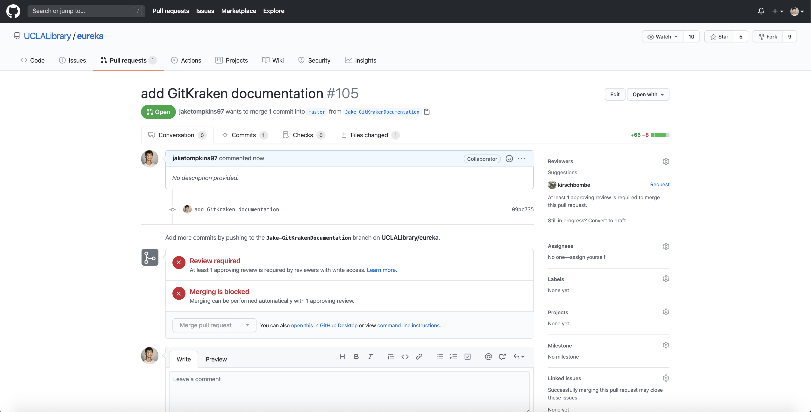
